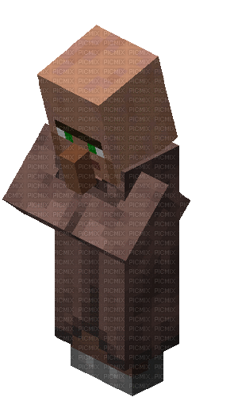
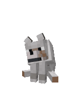
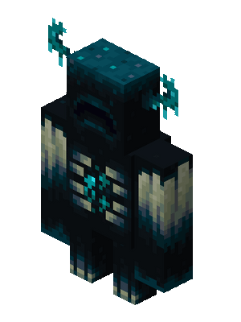
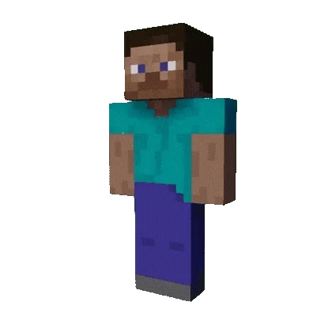

# back-voluntariado-extensao
<p>Este é o back-end que estou estruturando para o nosso projeto de voluntários</p>
<br>
    <h1>Instalação</h1>
<br>

<p>
    &nbsp;&nbsp;
    Entrar na pasta do backend com um terminal (recomendo usar o PowerShell)
</p>

<p>
    &nbsp;&nbsp;
    Criar ambiente virtual
</p>

```shell
python -m venv .venv
```
<p>
    &nbsp;&nbsp;
    Ativar o ambiente virtual
</p>

```shell
.\.venv\Scripts\python.exe
```

<p>
    
    Instalar as dependências
</p>

```shell
python -m pip install --upgrade pip
python -m pip install -r requirements.txt
```

<br>
<br>
<!-- TUTORIAL PARA RODAR O BACK-END -->
<h1>Arquivo .env</h1>

<p>
    
    No terminal powershell, dentro da pasta do backend, você pode rodar o comando
</p>

```shell
Copy-Item .env.example .env
```

<p>
    
    Ou você pode copiar todo o conteúdo do arquivo .env.example e colar dentro de um arquivo .env
</p>

<h1>Configurar arquivo .env</h1>

```env
APPLICATION_NAME="Você pode colocar qualquer nome personalizado"
DEPURATION=true
URL_DATABASE=sqlite:///data/database.db <-- Esse é o padrão

SECRET_KEY=coloque-uma-chave-secreta-aqui  <-- Próximo tópico explica isso
ALGORITHM=HS256 <-- Tipo de hash, pode alterar ou pode deixar assim mesmo

MINUTES_EXPIRE_ACCESS_TOKEN=30
MINUTES_EXPIRE_CONFIRMATION_EMAIL=15
MINUTES_RESEND_CONFIRMATION_EMAIL=5

ORIGENS_CORS=http://localhost:3000,http://localhost:5173
URL_FRONTEND=http://localhost:5173

EMAIL_ENABLED=true  <-- deixar "true" para a experiência completa de emissão de e-mail
USER_EMAIL=
PASSWORD_EMAIL=
SENDER_EMAIL=
SERVER_EMAIL=smtp.gmail.com
PORT_EMAIL=587
```

<p>
    &nbsp;&nbsp;
    Para gerar uma chave secreta para o .env no terminal powershell ou no cmd, escreva o código abaixo:
</p>

```shell
python -c "import secrets; print(secrets.token_urlsafe(64))"
```

<p>
    &nbsp;&nbsp;
    Copie o código monstruoso do terminal (botão direito do mouse copia o conteúdo selecionado em prompts) e cole o código monstruoso na variável SECRET_KEY do arquivo .env substituido o texto "coloque-uma-chave-secreta-aqui". A geração de chave secretas podem ser feitas por sites também caso seja preferível, esta é apenas uma opção fácil, mas funcional e seguro também
</p>

<p>
    
    Garantir que as pastas existem:
</p>

```shell
New-Item -ItemType Directory -Force data, uploads
```

<p>
    
    Caso o comando não funcione, você pode apenas ver se na raiz do projeto backend tem as pastas "data" e "uploads"
</p>

<p>
    
    Criar e atualizar o banco de dados
</p>

```shell
python -m alembic upgrade head
```

<p>
    
    Iniciar o backend
</p>

<br>
<br>

```shell
python -m uvicorn app.main:app --reload
```

<p>
    
    API: http://127.0.0.1:8000
</p>

<p>
    &nbsp;&nbsp;
    Documentação Swagger: http://127.0.0.1:8000/docs
</p>